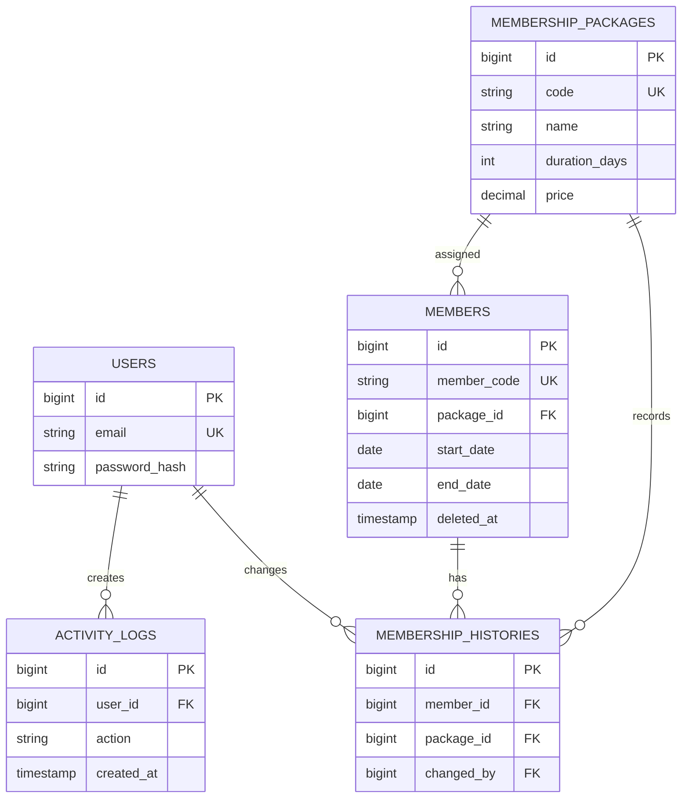

# Entity Relationship Diagram

```mermaid
erDiagram
  USERS ||--o{ ACTIVITY_LOGS : creates
  USERS ||--o{ MEMBERSHIP_HISTORIES : changes
  MEMBERSHIP_PACKAGES ||--o{ MEMBERS : assigned
  MEMBERS ||--o{ MEMBERSHIP_HISTORIES : has
  MEMBERSHIP_PACKAGES ||--o{ MEMBERSHIP_HISTORIES : records
  USERS { bigint id PK string email UK string password_hash }
  MEMBERSHIP_PACKAGES { bigint id PK string code UK string name int duration_days decimal price }
  MEMBERS { bigint id PK string member_code UK bigint package_id FK date start_date date end_date timestamp deleted_at }
  MEMBERSHIP_HISTORIES { bigint id PK bigint member_id FK bigint package_id FK bigint changed_by FK }
  ACTIVITY_LOGS { bigint id PK bigint user_id FK string action timestamp created_at }
```
